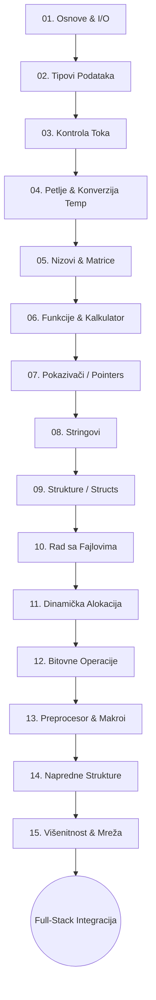

# SKOLICA — C Programiranje
Dobrodošli u repozitorijum **SKOLICA_C**! Ovaj repozitorijum služi kao arhivski i edukativni centar za učenje programskog jezika C. C je temelj modernog softverskog inženjerstva, sistemskog programiranja i upravljanja memorijom. U našem full-stack ekosistemu, C predstavlja polaznu tačku za razumevanje hardvera, memorije i struktura podataka na niskom nivou.

---

## 🗺️ Tok Učenja (Mermaid Diagram)



---

## 📂 Organizacija Repozitorijuma

Repozitorijum je organizovan po **Grupama** polaznika (npr. `Grupa1`, `Grupa2`, itd.). Svaka grupa ima svoj folder u kome se nalazi identičan, ali prilagođen nastavni plan i program koji prolazi kroz **15 nastavnih oblasti**.

Svaka nastavna oblast se sastoji od **3 predavanja**:
*   **predavanje_1**
*   **predavanje_2**
*   **predavanje_3**

Unutar svakog predavanja nalaze se sledeći fajlovi:
1.  `lekcija.md` — detaljno teorijsko objašnjenje koncepata, sintakse i primera.
2.  `primer.c` — praktičan kodni primer koji demonstrira naučene koncepte.

---

## 🛠️ Uputstvo za Pokretanje Koda

Da biste kompajlirali i pokrenuli C primere na vašem računaru, potreban vam je C kompajler (kao što je `gcc` ili `clang`).

### 1. Kompajliranje
Otvorite terminal (ili komandnu liniju), pozicionirajte se u folder predavanja i pokrenite sledeću komandu:

```bash
gcc primer.c -o program
```

### 2. Pokretanje
Nakon uspešnog kompajliranja, pokrenite izvršni fajl:

*   **macOS / Linux**:
    ```bash
    ./program
```
*   **Windows**:
    ```cmd
    program.exe
```

---

*Srećno učenje! Razumevanje C-a će vas učiniti izuzetnim inženjerom bez obzira na to koji jezik budete koristili u nastavku svoje karijere.*
